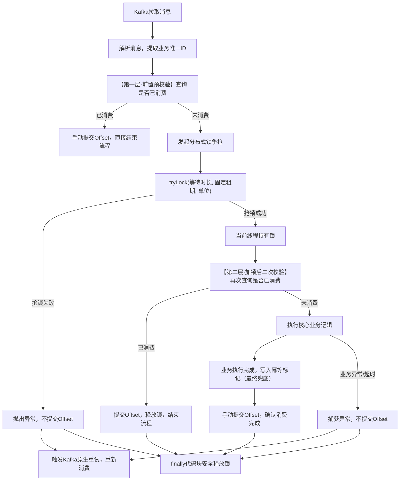

# Kafka消费幂等架构落地极简文档

# 一、架构核心设计目标

- 绝对保证消息**不重复消费、不丢失、不乱序**

- 规避分布式锁两大致命风险：线程卡死永久占锁、锁提前过期击穿幂等

- 适配复杂业务场景（含第三方调用、慢SQL、耗时波动、集群重试）

- 代码极简可直接复制上线，无过度设计

---

# 二、完整执行流程图



---

# 三、核心配置要求（必须生效）

## 1\. Kafka消费者核心配置

```yaml
spring:
  kafka:
    consumer:
      # 关闭自动提交，绝对核心
      enable-auto-commit: false
      auto-offset-reset: earliest
      # 单次拉取数量，避免批量消息导致锁争抢混乱
      max-poll-records: 1
    listener:
      # 手动提交模式
      ack-mode: MANUAL
```

## 2\. 分布式锁固定参数规范

|参数|推荐值|配置规则|
|---|---|---|
|WAIT\_TIME 抢锁等待时长|3秒|避免瞬时排队导致分区线程无限阻塞|
|LEASE\_TIME 锁最大持有租期|15秒|必须≥业务正常峰值耗时的3\~5倍，杜绝正常业务提前过期|

---

# 四、可直接上线完整代码

```java
import lombok.RequiredArgsConstructor;
import org.redisson.api.RLock;
import org.redisson.api.RedissonClient;
import org.springframework.kafka.annotation.KafkaListener;
import org.springframework.kafka.support.Acknowledgment;
import org.springframework.stereotype.Component;

import java.util.concurrent.TimeUnit;

@Component
@RequiredArgsConstructor
public class KafkaIdempotentConsumeTemplate {

    private final RedissonClient redissonClient;

    // 分布式锁核心参数
    private static final long WAIT_TIME = 3L;
    private static final long LEASE_TIME = 15L;

    @KafkaListener(topics = "YOUR_BIZ_TOPIC", groupId = "YOUR_CONSUMER_GROUP")
    public void consume(String message, Acknowledgment ack) {
        // 1. 提取业务唯一标识（订单ID/轨迹ID/设备ID，幂等核心字段）
        String bizUniqueId = extractBizUniqueId(message);
        String lockKey = "kafka:lock:biz:" + bizUniqueId;
        RLock lock = redissonClient.getLock(lockKey);

        // ====================== 第一层：加锁前预校验（性能优化，避免无效抢锁）
        if (isMessageConsumed(bizUniqueId)) {
            ack.acknowledge();
            return;
        }

        boolean lockSuccess = false;
        try {
            // ====================== 争抢分布式锁，关闭看门狗，防线程卡死死锁
            lockSuccess = lock.tryLock(WAIT_TIME, LEASE_TIME, TimeUnit.SECONDS);

            // 抢锁失败，抛出异常触发重试，不提交Offset
            if (!lockSuccess) {
                throw new RuntimeException("分布式锁争抢失败，等待重试");
            }

            // ====================== 第二层：加锁后二次校验（核心防穿透，杜绝锁失效重复消费）
            if (isMessageConsumed(bizUniqueId)) {
                ack.acknowledge();
                return;
            }

            // ====================== 执行业务核心逻辑
            executeBizLogic(message);

            // ====================== 标记消费完成，最终幂等兜底
            markConsumedSuccess(bizUniqueId);

            // 消费完全成功，手动提交偏移量
            ack.acknowledge();

        } catch (Exception e) {
            // 所有异常均不提交Offset，保证消息可重试
            throw new RuntimeException("消息消费异常，触发重试", e);
        } finally {
            // 仅当前持有锁的线程可释放，避免误释放其他线程锁
            if (lockSuccess && lock.isHeldByCurrentThread()) {
                lock.unlock();
            }
        }
    }

    /**
     * 从消息体解析业务唯一ID，自行实现JSON解析逻辑
     */
    private String extractBizUniqueId(String message) {
        // 示例：return JSONUtil.parseObj(message).getStr("traceId");
        return "";
    }

    /**
     * 查询消息是否已消费，优先查Redis，兜底查数据库幂等表
     */
    private boolean isMessageConsumed(String bizUniqueId) {
        // 实现Redis/数据库查询逻辑
        return false;
    }

    /**
     * 标记消息已消费，推荐Redis+数据库双写，保证可靠性
     */
    private void markConsumedSuccess(String bizUniqueId) {
        // 实现幂等标记写入逻辑
    }

    /**
     * 实际业务消费逻辑
     */
    private void executeBizLogic(String message) {
        // 业务处理逻辑
    }
}
```

---

# 五、方案风险全覆盖对照表

|风险场景|原方案隐患|本方案防护机制|
|---|---|---|
|业务线程卡死、死循环、JVM存活|无参lock\(\)看门狗无限续期，锁永久占用，分区卡死|固定LEASE\_TIME，到期自动释放锁，分区自动恢复|
|业务超长执行，锁提前过期释放|并发线程抢锁，重复执行业务，幂等击穿|加锁后二次校验，拦截已消费状态，绝对不重复执行|
|重复消息、重试消息涌入|大量无效锁争抢，压垮Redis|前置预校验，已消费消息直接跳过，无锁争抢|
|消费异常、业务报错|自动提交Offset导致消息丢失|手动提交，异常不ack，依赖Kafka原生重试|
|集群多节点同时消费同一条消息|并发执行，数据重复写入|分布式锁互斥\+双重校验\+数据库唯一索引三重兜底|

---

# 六、生产落地强制注意事项

1. **绝对禁止使用无参lock\(\)**，看门狗模式无法防护线程卡死导致的分区死锁

2. LEASE\_TIME必须严格评估业务最大耗时，严禁随意设置过短

3. 幂等查询必须基于**业务唯一ID**，禁止使用消息offset作为幂等字段

4. 数据库幂等表必须建立**唯一索引**，作为分布式锁失效的最终兜底

5. 禁止开启批量消费，单条消费才能保证幂等与锁机制稳定生效

6. 重试次数达到阈值后，必须配置死信队列，避免无限重试阻塞正常消息

7. finally块必须校验锁归属，仅当前持有锁的线程可执行解锁操作

---

# 七、最终方案总结

本方案无万能锁，通过**前置预校验\+分布式锁互斥\+加锁二次校验\+持久化幂等\+手动Offset**五层防护，平衡了「防死锁」与「防幂等击穿」两大核心矛盾，是互联网工业界Kafka消息消费的标准落地方案，适配绝大多数生产业务场景，稳定性与安全性拉满。

> （注：文档部分内容可能由 AI 生成）
